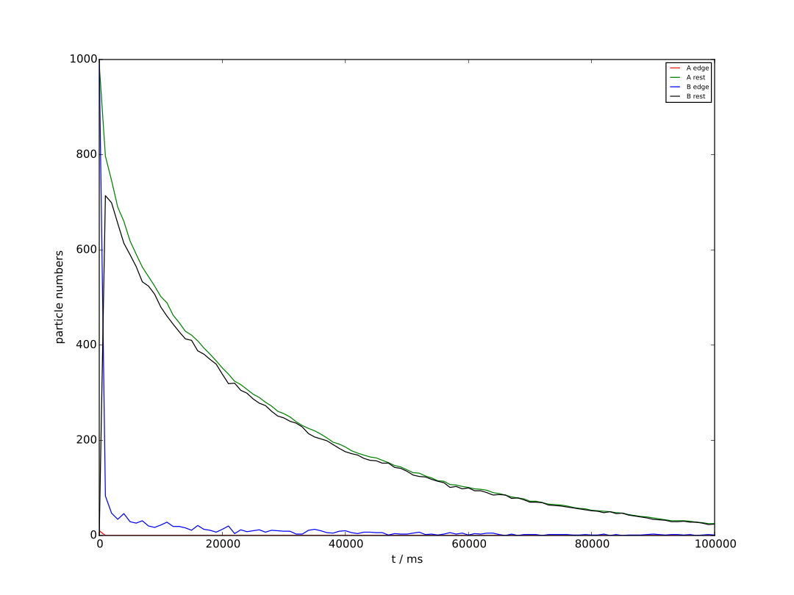

A + B diffusion and annihilation
================================

A very simple spatial model with 100 compartments and the following reactions:

* A + B → Φ

Described previously in

* J. Elf and M. Ehrenberg, Systems Biology **1**, 230 (2004).
* S. Lampoudi, D. T. Gillespie, and L. R. Petzold, The Journal of Chemical Physics **130**, 094104 (2009).
* W. Koh and K. T. Blackwell, The Journal of Chemical Physics **134**, 154103 (2011).

See `reactions.xml` for reaction and diffusion constants.

There are several model files in the directory, but all model files
are the same except for the specification of the method (at the end of
the file). Parameter ``<calculation>`` is ``GRID_EXACT`` for exact,
``GRID_STEPPED_STOCHASTIC`` for fixed-τ, and ``GRID_ADAPTIVE`` for
asynchronous. Both fixed-τ and asynchronous have one additional
parameter.  ``<tolerance>`` which is the accuracy control parameter
used for asynchronous and ``<fixedStepDt>`` which is the time step in
fixed-τ leaping.

Asynchronous leaping with ε=0.01
`````````````````````````````````


Exact stochastic simulation
```````````````````````````


