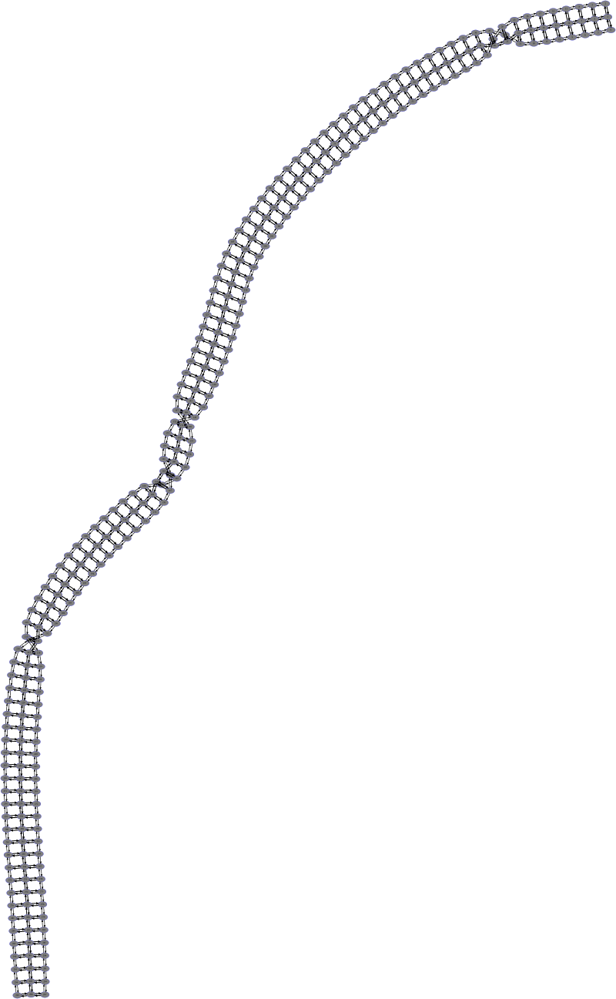

Large morphology variant of the model of production of cAMP stimulated by dopamine
==================================================================================

A model of production of cAMP stimulated by dopamine, with
bigger morphology. All model files include file called `morphology.xml`,
so to run with a specific morphology one should either symlink or copy
one of the morphology files to that name. For example:
.. code::
   ln -vfs morphology-450.xml morphology.xml
   java -Dstochdiff.writers=h5 -jar ../../stochdiff-3.0.0-all-deps.jar Model_cAMPassay1.5-PDE2600-async-0.01.xml

There are several model files in the directory, but all model files
are the same except for the specification of the method (at the end of
the file). Parameter ``<calculation>`` is ``GRID_EXACT`` for exact,
``GRID_STEPPED_STOCHASTIC`` for fixed-τ, and ``GRID_ADAPTIVE`` for
asynchronous. Both fixed-τ and asynchronous have one additional
parameter.  ``<tolerance>`` which is the accuracy control parameter
used for asynchronous and ``<fixedStepDt>`` which is the time step in
fixed-τ leaping.

Morphologies
~~~~~~~~~~~~

Morphologies of varying x-dimension, between L=1.0 and L=600.0 µm.
The morphology always consists of three compartments in the y-dimension:
1×1×0.25 µm³, 1×1×1 µm³, 1×1×0.25 µm³, repeated in the x-dimension to
achieve desired L.

V = 1×1×1.5 µm³
````````


V = 3×1×1.5 µm³
````````


V = 10×1×1.5 µm³
````````


V = 30×1×1.5 µm³
````````


V = 60×1×1.5 µm³
````````


V = 100×1×1.5 µm³
````````



V = 180×1×1.5 µm³
````````


V = 320×1×1.5 µm³
````````


V = 450×1×1.5 µm³
````````


V = 600×1×1.5 µm³
````````


