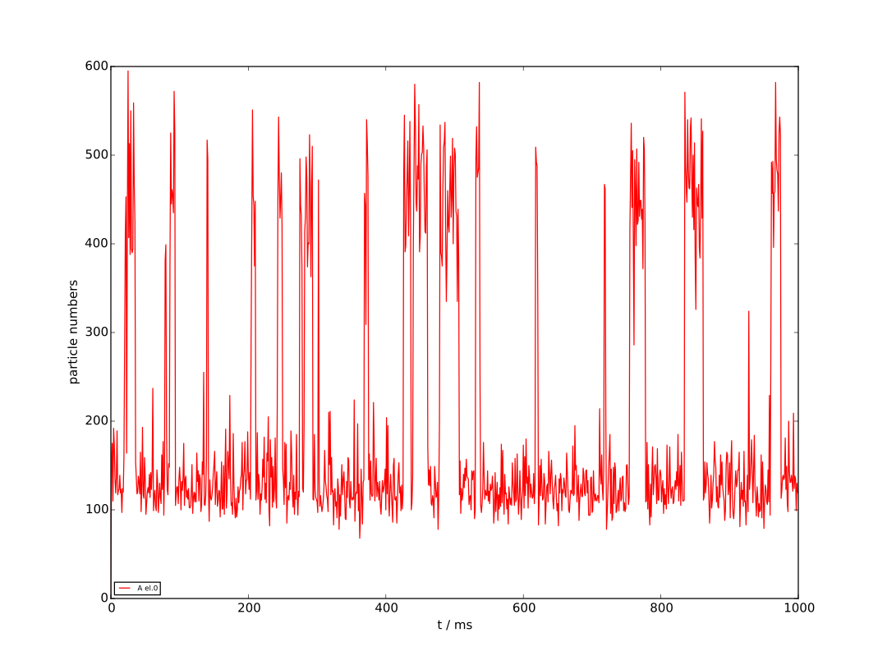
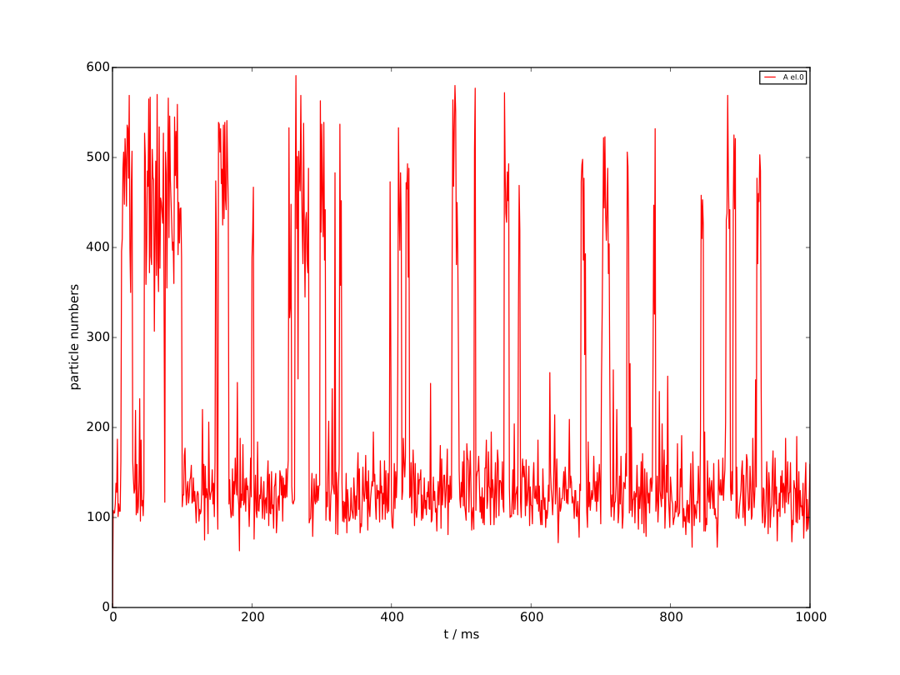
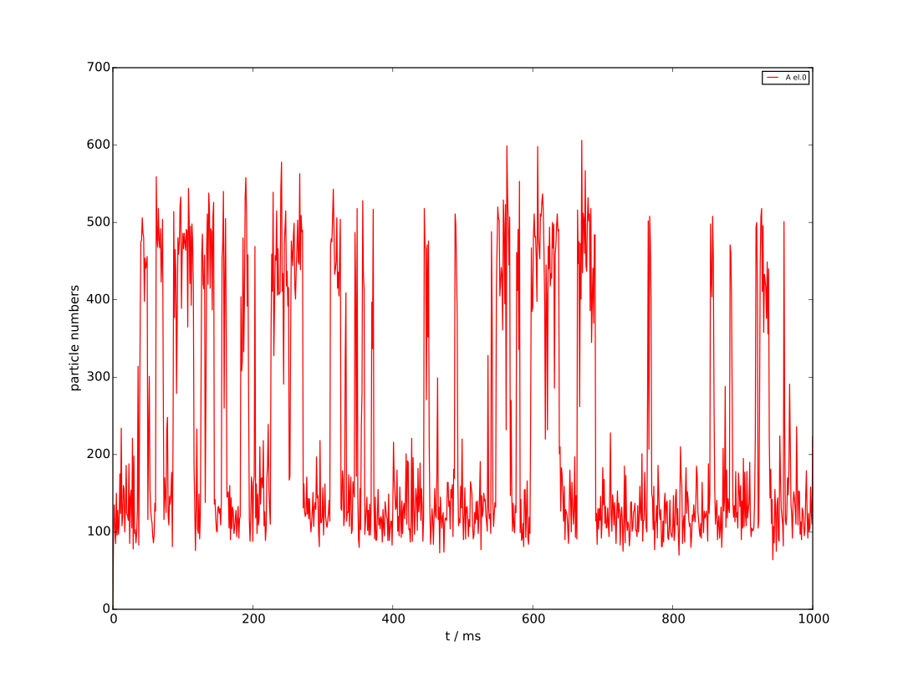
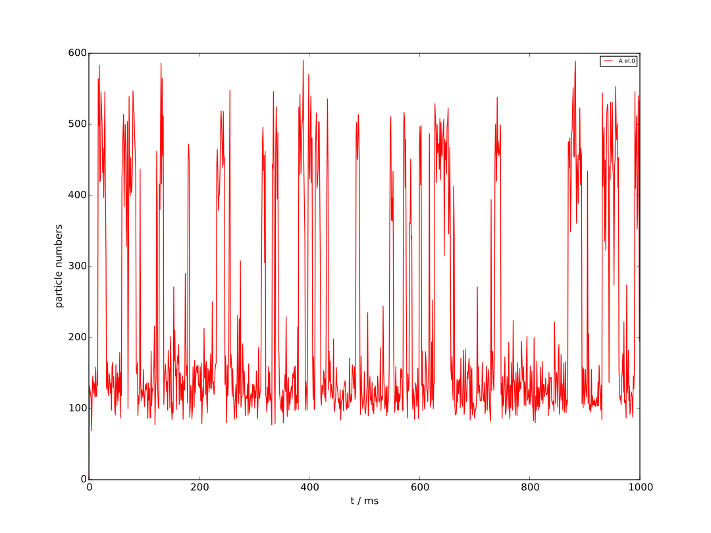

Bistable third-order model
==========================

Reactions:

* A ↔ Φ
* 3A ↔ 2A

Described previously in

* F. Schlögl, Zeitschrift für Physik **253**, 147 (1972)
* Y. Cao, D. T. Gillespie, and L. R. Petzold, The Journal of Chemical Physics **124**, 044109 (2006).
* R. Erban and S. J. Chapman, Physical Biology **4**, 16 (2007).

See `reactions.xml` for reaction constants.

There are several model files in the directory, but all model files
are the same except for the specification of the method (at the end of
the file). Parameter ``<calculation>`` is ``GRID_EXACT`` for exact,
``GRID_STEPPED_STOCHASTIC`` for fixed-τ, and ``GRID_ADAPTIVE`` for
asynchronous. Both fixed-τ and asynchronous have one additional
parameter.  ``<tolerance>`` which is the accuracy control parameter
used for asynchronous and ``<fixedStepDt>`` which is the time step in
fixed-τ leaping.

Asynchronous leaping with ε=0.001
`````````````````````````````````



Asynchronous leaping with ε=0.05
````````````````````````````````



Exact stochastic simulation
```````````````````````````


Fixed leaping with τ=0.00001 ms
```````````````````````````````



Fixed leaping with τ=0.0001 ms
``````````````````````````````


